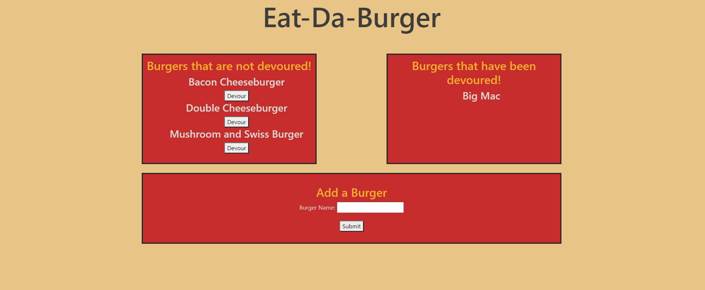

 #    Eat-Da-Burger

 This is a full stack MVC app that alows users to create a new burger then eat the butger. This app was intended to test my knowledge using POST GET and PUT methods. 
 
 ## Table of Contents
 * [Installation](#Installation)
 * [Usage](#Usage)
 * [License](#License)
 * [Contributing](#Contributing)
 * [Tests](#Tests)
 * [Questions](#Questions)
 
 
 ## Installation
 
 > git clone git@github.com:sharkattack182/burger.git
 > cd burger
 > npm install
 
 
 ## Usage
 
 > 
 
 
 ## License
 [MIT]  This project is covered by the MIT license
 
 ## Contributing
 
 
 ## Tests
 

 ## Questions
 for any questions visit my GitHub [sharkattack182](https://github.com/sharkattack182).
 or email me at matthewdc182@gmail.com.

  ## Visuals
 example of the view functions
 

  ## Links
 [GitHub](https://github.com/sharkattack182/burger)
